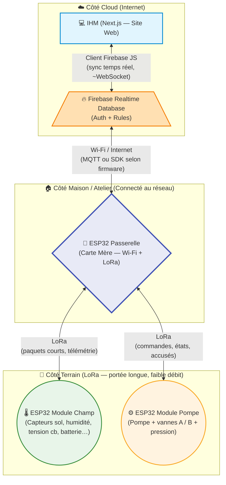
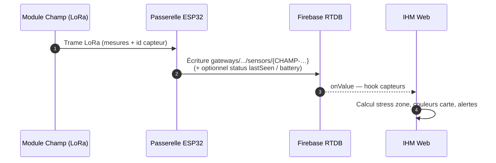
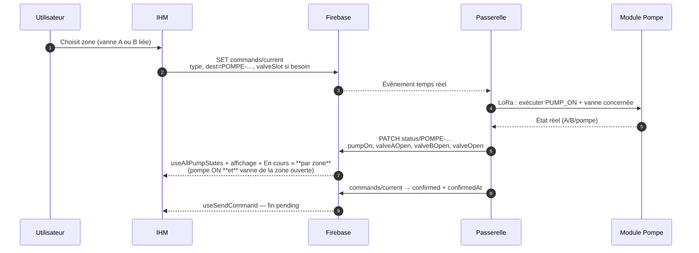
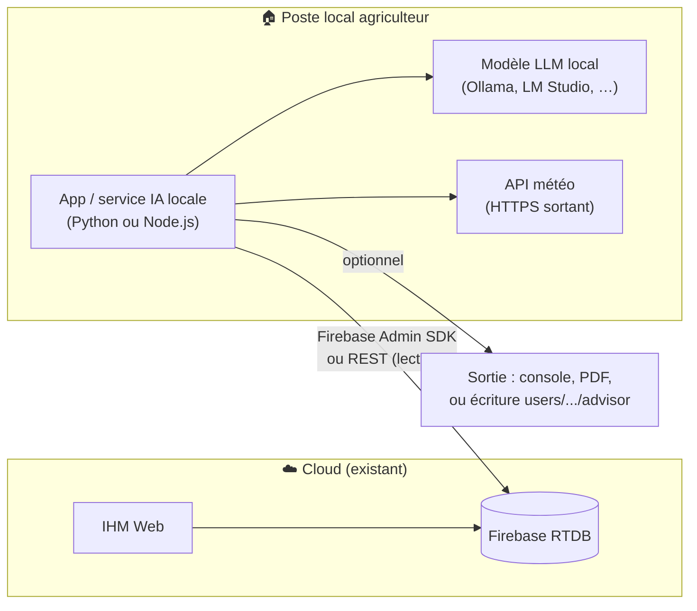

# Architecture globale du système d’irrigation — document détaillé

Ce document décrit de façon **exhaustive** (vue d’ensemble, données, flux, identification, sécurité) l’articulation entre **IHM**, **Firebase Realtime Database**, **passerelle ESP32**, **modules champ** et **module pompe**.

---

## 1. Objectifs du système

| Objectif | Réalisation |
|----------|-------------|
| Supervision à distance | IHM web connectée à une BDD temps réel |
| Mesures terrain | Modules champ (LoRa) → passerelle → cloud |
| Pilotage irrigation | Commandes pompe / vannes A & B, états retour |
| Multi-utilisateur | Firebase Auth + données isolées par `uid` |
| Passerelle unique | Un point Wi-Fi pour tout le réseau LoRa terrain |

---

## 2. Vue d’ensemble (schéma principal)



---

## 3. Répartition des données Firebase (deux « mondes »)

L’IHM lit/écrit selon que le matériel est **rattaché à une passerelle** (`gatewayId` + `deviceId`) ou **legacy** (données uniquement sous `users/{uid}`).

```mermaid
flowchart LR
  subgraph UserSpace["users/{uid}/…"]
    U1[modules]
    U2[zones / farms]
    U3[linkedGateways]
    U4[commands/{moduleId}]
    U5[actuatorState/{moduleId}]
    U6[sensorData ou agrégats]
  end

  subgraph GwSpace["gateways/{gatewayId}/…"]
    G1[sensors/{deviceId}]
    G2[status/{deviceId}]
    G3[commands/current]
    G4[sensorsHistory/…]
    G5[pumpActivity/{deviceId}]
    G6[lastSeen]
  end

  IHM[IHM Next.js] --> UserSpace
  IHM --> GwSpace
  GW[ESP32 Passerelle] --> GwSpace
  GW -.->|synchronisation / miroir possible| UserSpace
```

### 3.1 Arborescence utile (résumé)

| Zone RTDB | Contenu typique | Consommateurs |
|-----------|-----------------|---------------|
| `users/{uid}/modules/{id}` | Fiche module : `type`, `farmId`, `gatewayId`, `deviceId`, `position`, `lastSeen`… | IHM matériel, cartes |
| `users/{uid}/zones/{id}` | Polygone, `fieldModuleIds`, `pumpModuleId(s)`, `sectors[].valveSlot` (A/B), `mode` | Irrigation, carte |
| `users/{uid}/linkedGateways/{gatewayId}` | Lien ferme / nom passerelle | Filtrage modules |
| `users/{uid}/commands/{moduleId}` | File de commande **sans passerelle dédiée** (legacy) | `useSendCommand` si pas de `gatewayId` |
| `users/{uid}/actuatorState/{moduleId}` | `pumpOn`, `valveOpen`, `valveAOpen`, `valveBOpen` (legacy pompe) | IHM, simulateur modules |
| `gateways/{id}/commands/current` | Commande en cours : `dest`, `type`, `status`, `valveSlot`, `createdAt`… | Passerelle + IHM |
| `gateways/{id}/status/{deviceId}` | État pompe/capteur côté terrain | `useAllPumpStates`, cartes |
| `gateways/{id}/sensors/{deviceId}` | Dernier snapshot capteur (`humidity`, `tension_cb`, `battery`…) | Tableaux de bord, stress zones |
| `gateways/{id}/pumpActivity/{deviceId}/{date}` | Minutes / volume par jour | Historique, quotas |

### 3.2 Identifiants matériels (`deviceId`)

Convention courante dans le projet : préfixes **canoniques** + suffixe hexadécimal (ex. `CHAMP-99887766`, `POMPE-1234ABCD`, passerelle `MERE-XXXXXXXX`).  
Le site **essaie plusieurs chemins** (`buildGatewayDeviceIds`) pour rester compatible avec d’anciens enregistrements (`DEVICE-…`, `moduleId` seul).

---

## 4. Rôles détaillés par composant

### 4.1 IHM (site Next.js)

- **Authentification** : Firebase Auth ; toutes les lectures/écritures `users/{uid}` sont scopées à l’utilisateur connecté (sauf règles spécifiques).
- **Fonctions principales** : dashboard, **irrigation & zones** (polygones, capteur, vanne A/B, démarrage/arrêt), matériel, alertes, historique, **simulateur** (bac à sable / jumeau).
- **Temps réel** : `onValue` / hooks (`useZones`, `useModules`, `useAllPumpStates`, `useLatestSensorMap`, `useSendCommand`…).
- **Commandes pompe** :
  - Si `gatewayId` + `deviceId` : écriture sous `gateways/{gatewayId}/commands/current` avec `valveSlot` **A** ou **B** quand la commande est ciblée (mapping `VALVE_A_*` → `VALVE_OPEN` + `valveSlot`).
  - Sinon : `users/{uid}/commands/{moduleId}` + mise à jour transactionnelle de `actuatorState`.

### 4.2 Firebase Realtime Database

- **Source de vérité** partagée entre IHM, passerelle, scripts, simulateur.
- **Règles de sécurité** (`database.rules.json`) : contrôle qui peut lire/écrire `users/…`, `gateways/…` (souvent token passerelle ou utilisateur authentifié selon ta config).
- **Pas de logique métier** dans la BDD : uniquement stockage et sync.

### 4.3 ESP32 Passerelle (carte mère)

- **Wi-Fi** : maintient la session vers Internet (Firebase ou broker intermédiaire selon firmware).
- **LoRa** : collecte des trames champ, envoi des commandes pompe, gestion des IDs nœuds.
- **Cœur du routage** : reçoit une commande cloud (`commands/current`), la traduit en paquet LoRa vers le **deviceId** cible (`POMPE-…`).
- **Rythme** : heartbeat (`lastSeen`) pour savoir si la passerelle est « en ligne » côté IHM.

### 4.4 ESP32 Module Champ

- Capteurs : **humidité**, **tension du sol (cb)**, parfois **pH**, **batterie**, variantes profondeur (ex. 10 cm / 30 cm).
- Émet par **LoRa** vers la passerelle ; pas d’accès Wi-Fi direct au cloud dans l’architecture cible.
- Peut être **endormi** entre deux mesures pour l’autonomie.

### 4.5 ESP32 Module Pompe

- Reçoit les ordres : **PUMP_ON / OFF**, **ouverture / fermeture vanne A**, **idem B** (ou vanne unique en mode legacy).
- Remonte : **pumpOn**, **valveAOpen**, **valveBOpen**, **pression**, **lastSeen**.
- Peut piloter **deux circuits** (zones différentes sur la même pompe) via vannes A et B.

---

## 5. Flux détaillé — mesure capteur (Champ → IHM)



---

## 6. Flux détaillé — irrigation (IHM → Pompe, vannes A/B)



**Point important** : côté IHM, l’état **« En cours »** pour une zone doit combiner **`pumpOn`** et l’ouverture de la **vanne associée** (A ou B), pas seulement la pompe — sinon deux zones sur la même pompe semblent toutes irriguer dès que la pompe tourne.

---

## 7. Flux legacy (sans passerelle dédiée sur la commande)

Utilisé pour **simulateur de modules** (`SIM_POMP_*`) ou anciennes install :

1. IHM écrit `users/{uid}/commands/{moduleId}` en `pending`.
2. Le **simulateur** ou un script confirme la commande après délai.
3. Mise à jour `users/{uid}/actuatorState/{moduleId}` avec les booléens pompe / vannes.

---

## 8. Stack technique (référence)

| Couche | Technologies |
|--------|----------------|
| IHM | Next.js 14, React, Tailwind, Firebase JS SDK, Leaflet (cartes) |
| Auth | Firebase Authentication |
| Données | Firebase Realtime Database |
| Terrain | ESP32, LoRa (SX12xx selon carte), firmware dédié Champ / Pompe / Mère |
| Simulateur intégré (site) | Bac à sable `simulators/{uid}/sandboxes/…` + scénarios |
| App externe « Simulateur modules » | Vite + React (projet `Simulator/` à part) |

---

## 9. Sécurité (principes)

- Accès **`users/{uid}`** typiquement réservé au propriétaire `uid` authentifié.
- Accès **`gateways/{gatewayId}`** : selon règles (secret passerelle, compte service, ou utilisateur lié via `linkedGateways`).
- Ne **jamais** exposer clés Firebase ou secrets passerelle dans le dépôt public ; utiliser variables d’environnement.

---

## 10. Limites & contraintes réalistes

| Contrainte | Conséquence |
|------------|----------------|
| LoRa : faible débit | Payloads courts, pas de vidéo ; agrégation côté passerelle |
| Latence radio + cloud | Délai visible entre clic IHM et action physique (d’où « pending » / ACK) |
| Une pompe, deux vannes | Deux zones peuvent partager la même pompe mais **pas** le même créneau A ou B en même temps côté config |
| Passerelle hors ligne | Dernières valeurs en BDD figées ; modules terrain peuvent continuer en local selon firmware |

---

## 11. Légende synthétique des blocs schéma

| Bloc | Rôle |
|------|------|
| **IHM** | Interface opérateur : zones, irrigation, matériel, alertes, historique, simulateur. |
| **Firebase** | Persistance temps réel, auth, règles d’accès. |
| **Passerelle** | Unique lien IP ; route LoRa ↔ cloud. |
| **Module Champ** | Acquisition capteurs sol / environnement. |
| **Module Pompe** | Actionneurs pompe + vannes A/B + retours d’état. |

---

## 12. Extension possible : application IA **en local** connectée à la BDD

**Oui, c’est possible.** L’idée est d’ajouter un **service ou une appli qui tourne sur la machine de l’exploitant** (PC ferme, mini-PC, NAS) qui :

1. **Lit** les données déjà dans Firebase (capteurs, zones, historique partiel, état pompe).
2. **Enrichit** avec des données **météo** (API publique : Open-Meteo, Météo-France ou autre — selon licence et besoin).
3. **Produit des conseils** (texte structuré : irrigation, stress hydrique, fenêtre météo, rappels) via un **modèle de langage** ou des **règles + LLM**.

### 12.1 Schéma d’architecture (IA locale)



### 12.2 Connexion à Firebase depuis la machine locale

| Approche | Usage |
|----------|--------|
| **Firebase Admin SDK** (Node, Python, Go…) | Recommandé : compte **service account** (JSON) sur le PC local, **lecture** (et écriture optionnelle sur un chemin dédié `users/{uid}/advisor/...`). Les **règles RTDB** doivent autoriser ce compte ou passer par un **Cloud Function** proxy (plus complexe). |
| **Client SDK + compte dédié** | Possible mais moins propre pour un bot longue durée ; préférer Admin côté « agent ». |
| **Export / snapshot** | Fichier JSON périodique depuis une fonction cloud ou script — simple mais pas temps réel. |

**Sécurité** : ne jamais committer le fichier de clé service account ; variables d’environnement ou coffre-fort (Windows Credential, Vault).

### 12.3 Données utiles pour conseiller l’agriculteur

| Source | Exemples de champs |
|--------|---------------------|
| **Capteurs** (gateways ou users) | `tension_cb`, `humidity`, `battery`, par `deviceId` / zone |
| **Zones** | Polygone, culture (si tu l’ajoutes), vanne A/B, mode auto |
| **Météo** | Pluie prévue 24–48 h, ETP, température, vent (pour évaporation) |
| **Historique** | `sensorsHistory`, `pumpActivity` pour tendances et quotas |
| **Règles métier existantes** | Seuils d’alerte déjà dans l’IHM — l’IA peut les **expliquer** ou les **combiner** au langage naturel |

### 12.4 Options pour le « cerveau » IA (local)

| Option | Avantages | Inconvénients |
|--------|-----------|----------------|
| **Ollama / LM Studio** (Llama, Mistral, etc.) | Données sensibles restent en local, pas d’abonnement LLM cloud | GPU conseillé pour réactivité ; qualité modèle à calibrer |
| **Règles déterministes + petit LLM** | Fiable pour « si tension > X et pluie > Y → ne pas irriguer » | Moins « conversationnel » |
| **API cloud** (OpenAI, etc.) | Très bon français / raisonnement | Données envoyées hors ferme ; RGPD / contrat à vérifier |

**Bon compromis** : pipeline **hybride** — calculs et seuils **en code** (comme aujourd’hui) + **LLM local** uniquement pour **rédiger** le conseil à partir d’un résumé structuré (JSON) fourni par ton programme.

### 12.5 Exemple de boucle côté local (logique)

1. Toutes les **15 min** (ou via stream Admin) : récupérer derniers capteurs par zone.
2. Appeler **Open-Meteo** (gratuit, sans clé pour usage basique) pour lat/lon de la ferme ou du champ.
3. Construire un **prompt** ou un **JSON** : `{ zones: [...], meteo_24h: {...}, alertes: [...] }`.
4. Passer au **LLM local** : « Tu es un conseiller agricole. Propose 3 actions prioritaires en français, sans inventer de chiffres. »
5. Afficher dans une **petite UI locale** (Streamlit, Electron) ou **écrire** dans `users/{uid}/advisor/latest` pour que l’**IHM** l’affiche plus tard (nécessite développement côté Site).

### 12.6 Limites à anticiper

- **Qualité des conseils** : l’IA ne remplace pas l’agronome ; disclaimers et seuils de sécurité (ne jamais commander la pompe sans validation humaine sauf si tu formalises une politique très stricte).
- **Fiabilité réseau** : si la ferme perd Internet, l’app locale peut encore lire un **cache** ou la dernière sync.
- **Coût** : local = électricité + matériel ; cloud LLM = requêtes facturées.

---

## 13. Afficher / exporter les diagrammes

- **GitHub** : rendu natif des blocs ` ```mermaid `.
- **VS Code** : prévisualisation Markdown ou extension « Mermaid ».
- **PNG / SVG** : [mermaid.live](https://mermaid.live) — copier-coller chaque diagramme.

---

*Document aligné sur l’architecture du dépôt Site (hooks `gatewayDevicePaths`, irrigation par vanne, double chemin commandes gateway / users). À adapter si ton firmware utilise un broker MQTT intermédiaire sans écriture Firebase directe depuis la passerelle.*
