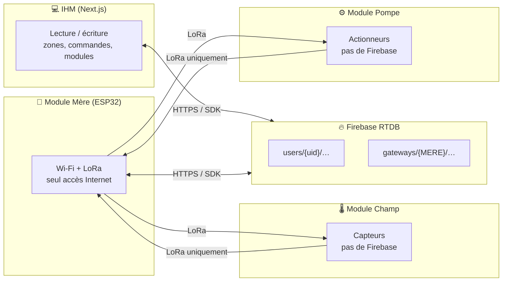
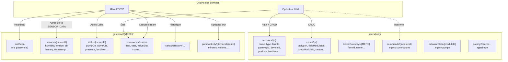
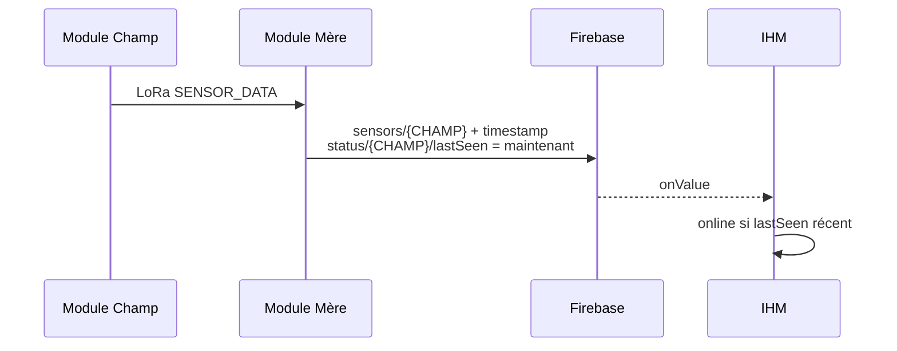
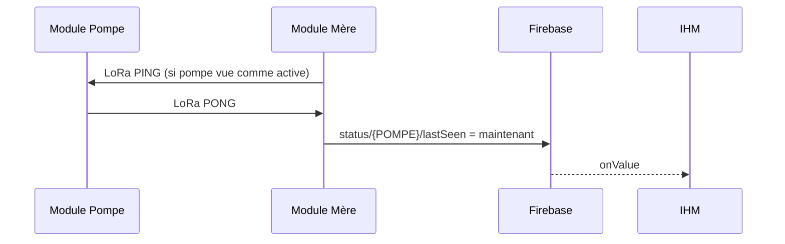

# Fonctionnement de `lastSeen` et flux de données vers la BDD

Ce document répond à : **comment fonctionne `lastSeen` ?**, **qui l’écrit pour le Champ et la Pompe (eux-mêmes ou la Mère ?)**, et **quoi stocker dans la BDD** pour l’IHM.

---

## 1. Rôle de `lastSeen`

**`lastSeen`** est un **horodatage** (souvent en **millisecondes** depuis epoch Unix, ou équivalent selon le nœud) qui indique **la dernière fois où le système « côté cloud » a eu une preuve d’activité** pour :

- la **passerelle** elle-même ;
- un **module Champ** (capteur) ;
- un **module Pompe** (actionneur).

Côté **IHM**, ce champ sert surtout à calculer **en ligne / hors ligne** : si `Date.now() - lastSeen` dépasse un seuil (ex. 5 minutes), le module est affiché comme **hors ligne** (`useModules`, `useLinkedGateways`).

> **Important :** ce n’est pas forcément l’instant exact où le capteur a mesuré sur le terrain ; c’est souvent **l’instant où la Mère a reçu la trame LoRa et a écrit dans Firebase**.

---

## 2. Qui gère `lastSeen` pour le Champ et la Pompe ?

### Réponse courte

| Module | Accès direct à Firebase ? | Qui écrit `lastSeen` dans la BDD ? |
|--------|---------------------------|-------------------------------------|
| **Module Champ** (ESP32) | **Non** (pas de Wi-Fi cloud dans l’archi cible) | **Module Mère** (passerelle), après réception LoRa |
| **Module Pompe** (ESP32) | **Non** | **Module Mère**, après réception LoRa (ex. PONG, ou mise à jour d’état) |
| **Module Mère** (passerelle) | **Oui** | **Elle-même** pour `gateways/{id}/lastSeen` |

Les firmwares **Champ** et **Pompe** ne stockent **pas** `lastSeen` dans Firebase : ils envoient des **trames LoRa** ; la **Mère** est le **seul** pont vers Internet et **matérialise** l’activité dans la BDD.

### Détail (firmware Mère typique)

- **`gateways/{MERE-id}/lastSeen`**  
  Écrit par la **Mère** (heartbeat : au démarrage puis périodiquement) → indique que la **passerelle** est vivante côté cloud.

- **`gateways/{MERE-id}/status/{CHAMP-id}/lastSeen`**  
  Écrit par la **Mère** quand elle reçoit une trame **`SENSOR_DATA`** LoRa en provenance du Champ → « dernier contact vu depuis le réseau » pour ce capteur.

- **`gateways/{MERE-id}/status/{POMPE-id}/lastSeen`**  
  Écrit par la **Mère** notamment quand elle reçoit un **`PONG`** (réponse à un **PING**) de la pompe, ou lors de mises à jour d’état liées aux commandes → « dernier contact » pour la pompe.

- **`users/{uid}/modules/{moduleId}/lastSeen`** (si utilisé)  
  Peut être mis à jour par la Mère, un script, ou le **simulateur** ; l’IHM fusionne souvent avec les infos `gateways/.../status` pour l’affichage « en ligne ».

---

## 3. Schéma global — qui envoie quoi (sans détail des champs)

**Lecture IHM :** uniquement via **BDD** (pas de LoRa).  
**Écriture activité terrain :** **Mère** après événements LoRa (ou commandes cloud relayées).

---

## 4. Schéma détaillé — données qui transitent (vue BDD)

Ci-dessous : **types d’informations** et **où les stocker** pour que l’IHM reste cohérente. Les chemins exacts peuvent varier selon `deviceId` / alias (`CHAMP-…`, `POMPE-…`).

### Table récapitulative — « que doit stocker la BDD » (pour l’IHM)

| Donnée | Rôle | Chemin typique | Mis à jour par |
|--------|------|----------------|----------------|
| Identité module | Lier ferme, carte, passerelle | `users/.../modules/{id}` | IHM + éventuellement Mère / sync |
| Zones & irrigation | Polygones, capteur, vanne A/B | `users/.../zones/{id}` | IHM |
| Passerelle « vivante » | Savoir si la Mère parle au cloud | `gateways/{MERE}/lastSeen` | **Mère** |
| Dernier snapshot capteur | Stress, alertes, cartes | `gateways/.../sensors/{CHAMP}` | **Mère** (après LoRa) |
| Dernier contact capteur | Online/offline capteur | `gateways/.../status/{CHAMP}/lastSeen` | **Mère** |
| État pompe / vannes | Boutons, carte, irrigation | `gateways/.../status/{POMPE}` | **Mère** (LoRa + commandes) |
| Dernier contact pompe | Online pompe | `gateways/.../status/{POMPE}/lastSeen` | **Mère** |
| Commande en cours | Pilotage | `gateways/.../commands/current` | IHM écrit ; Mère lit & confirme |
| Activité irrigation | Historique / quotas | `gateways/.../pumpActivity/...` | **Mère** (LoRa PUMP_ACTIVITY) |
| Commandes legacy | Sans passerelle dédiée | `users/.../commands/{id}` | IHM + client/simulateur |
| État legacy pompe | Simulateur / ancien mode | `users/.../actuatorState/{id}` | IHM / simulateur / batch |

---

## 5. Séquence simplifiée — `lastSeen` Champ

---

## 6. Séquence simplifiée — `lastSeen` Pompe

*(D’autres mises à jour de `status/{POMPE}` peuvent avoir lieu après **CMD_ACK** ou application d’état côté Mère selon firmware.)*

---

## 7. Synthèse

- **`lastSeen` = signal de vie côté cloud**, pas un champ que le Champ ou la Pompe écrivent directement dans Firebase.  
- **La Module Mère centralise** les écritures liées au **terrain** sous `gateways/{MERE}/…`.  
- L’**IHM** ne parle qu’à la **BDD** ; elle déduit l’**online** à partir des **timestamps** et des seuils configurés.

Pour aller plus loin sur l’architecture générale, voir **`architecture-systeme.md`** et **`RAPPORT_ARCHITECTURE_SYSTEME.md`**.
